# Projects and dependencies analysis

This document provides a comprehensive overview of the projects and their dependencies in the context of upgrading to .NETCoreApp,Version=v10.0.

## Table of Contents

- [Executive Summary](#executive-Summary)
  - [Highlevel Metrics](#highlevel-metrics)
  - [Projects Compatibility](#projects-compatibility)
  - [Package Compatibility](#package-compatibility)
  - [API Compatibility](#api-compatibility)
  - [Binding Redirect Configuration](#binding-redirect-configuration)
- [Aggregate NuGet packages details](#aggregate-nuget-packages-details)
- [Top API Migration Challenges](#top-api-migration-challenges)
  - [Technologies and Features](#technologies-and-features)
  - [Most Frequent API Issues](#most-frequent-api-issues)
- [Projects Relationship Graph](#projects-relationship-graph)
- [Project Details](#project-details)

  - [src\ApiGateways\OcelotApiGw\OcelotApiGw.csproj](#srcapigatewaysocelotapigwocelotapigwcsproj)
  - [src\BuildingBlocks\Common.Logging\Common.Logging.csproj](#srcbuildingblockscommonloggingcommonloggingcsproj)
  - [src\BuildingBlocks\Contracts\Contracts.csproj](#srcbuildingblockscontractscontractscsproj)
  - [src\BuildingBlocks\EventBus\EventBus.MessageComponents\EventBus.MessageComponents.csproj](#srcbuildingblockseventbuseventbusmessagecomponentseventbusmessagecomponentscsproj)
  - [src\BuildingBlocks\EventBus\EventBus.Messages\EventBus.Messages.csproj](#srcbuildingblockseventbuseventbusmessageseventbusmessagescsproj)
  - [src\BuildingBlocks\Infrastructure\Infrastructure.csproj](#srcbuildingblocksinfrastructureinfrastructurecsproj)
  - [src\BuildingBlocks\Shared\Shared.csproj](#srcbuildingblockssharedsharedcsproj)
  - [src\Saga.Orchestrator\Saga.Orchestrator.csproj](#srcsagaorchestratorsagaorchestratorcsproj)
  - [src\Services\Basket\Basket.API\Basket.API.csproj](#srcservicesbasketbasketapibasketapicsproj)
  - [src\Services\Customer\Customer.API\Customer.API.csproj](#srcservicescustomercustomerapicustomerapicsproj)
  - [src\Services\Identity\IDP\IDP.csproj](#srcservicesidentityidpidpcsproj)
  - [src\Services\Identity\Infrastructure\IDP.Infrastructure.csproj](#srcservicesidentityinfrastructureidpinfrastructurecsproj)
  - [src\Services\Identity\Presentation\IDP.Presentation.csproj](#srcservicesidentitypresentationidppresentationcsproj)
  - [src\Services\Identity\Shared\Shared.csproj](#srcservicesidentitysharedsharedcsproj)
  - [src\Services\Inventory\Inventory.Grpc\Inventory.Grpc.csproj](#srcservicesinventoryinventorygrpcinventorygrpccsproj)
  - [src\Services\Inventory\Inventory.Product.API\Inventory.Product.API.csproj](#srcservicesinventoryinventoryproductapiinventoryproductapicsproj)
  - [src\Services\Ordering\Ordering.API\Ordering.API.csproj](#srcservicesorderingorderingapiorderingapicsproj)
  - [src\Services\Ordering\Ordering.Application\Ordering.Application.csproj](#srcservicesorderingorderingapplicationorderingapplicationcsproj)
  - [src\Services\Ordering\Ordering.Domain\Ordering.Domain.csproj](#srcservicesorderingorderingdomainorderingdomaincsproj)
  - [src\Services\Ordering\Ordering.Infrastructure\Ordering.Infrastructure.csproj](#srcservicesorderingorderinginfrastructureorderinginfrastructurecsproj)
  - [src\Services\Product\Product.API\Product.API.csproj](#srcservicesproductproductapiproductapicsproj)
  - [src\Services\ScheduledJob\Hangfire.API\Hangfire.API.csproj](#srcservicesscheduledjobhangfireapihangfireapicsproj)
  - [src\WebApps\WebHealthStatus\WebHealthStatus.csproj](#srcwebappswebhealthstatuswebhealthstatuscsproj)


## Executive Summary

### Highlevel Metrics

| Metric | Count | Status |
| :--- | :---: | :--- |
| Total Projects | 23 | All require upgrade |
| Total NuGet Packages | 69 | 25 need upgrade |
| Total Code Files | 437 |  |
| Total Code Files with Incidents | 54 |  |
| Total Lines of Code | 29581 |  |
| Total Number of Issues | 250 |  |
| Estimated LOC to modify | 169+ | at least 0.6% of codebase |

### Projects Compatibility

| Project | Target Framework | Difficulty | Package Issues | API Issues | Binding Issues | Est. LOC Impact | Description |
| :--- | :---: | :---: | :---: | :---: | :---: | :---: | :--- |
| [src\ApiGateways\OcelotApiGw\OcelotApiGw.csproj](#srcapigatewaysocelotapigwocelotapigwcsproj) | net8.0 | 🟢 Low | 7 | 15 | 0 | 15+ | AspNetCore, Sdk Style = True |
| [src\BuildingBlocks\Common.Logging\Common.Logging.csproj](#srcbuildingblockscommonloggingcommonloggingcsproj) | net8.0 | 🟢 Low | 1 | 12 | 0 | 12+ | ClassLibrary, Sdk Style = True |
| [src\BuildingBlocks\Contracts\Contracts.csproj](#srcbuildingblockscontractscontractscsproj) | net8.0 | 🟢 Low | 3 | 1 | 0 | 1+ | ClassLibrary, Sdk Style = True |
| [src\BuildingBlocks\EventBus\EventBus.MessageComponents\EventBus.MessageComponents.csproj](#srcbuildingblockseventbuseventbusmessagecomponentseventbusmessagecomponentscsproj) | net8.0 | 🟢 Low | 0 | 0 | 0 |  | ClassLibrary, Sdk Style = True |
| [src\BuildingBlocks\EventBus\EventBus.Messages\EventBus.Messages.csproj](#srcbuildingblockseventbuseventbusmessageseventbusmessagescsproj) | net8.0 | 🟢 Low | 0 | 0 | 0 |  | ClassLibrary, Sdk Style = True |
| [src\BuildingBlocks\Infrastructure\Infrastructure.csproj](#srcbuildingblocksinfrastructureinfrastructurecsproj) | net8.0 | 🟢 Low | 7 | 42 | 0 | 42+ | ClassLibrary, Sdk Style = True |
| [src\BuildingBlocks\Shared\Shared.csproj](#srcbuildingblockssharedsharedcsproj) | net8.0 | 🟢 Low | 0 | 0 | 0 |  | ClassLibrary, Sdk Style = True |
| [src\Saga.Orchestrator\Saga.Orchestrator.csproj](#srcsagaorchestratorsagaorchestratorcsproj) | net8.0 | 🟢 Low | 0 | 10 | 0 | 10+ | AspNetCore, Sdk Style = True |
| [src\Services\Basket\Basket.API\Basket.API.csproj](#srcservicesbasketbasketapibasketapicsproj) | net8.0 | 🟢 Low | 2 | 18 | 0 | 18+ | AspNetCore, Sdk Style = True |
| [src\Services\Customer\Customer.API\Customer.API.csproj](#srcservicescustomercustomerapicustomerapicsproj) | net8.0 | 🟢 Low | 4 | 16 | 0 | 16+ | AspNetCore, Sdk Style = True |
| [src\Services\Identity\IDP\IDP.csproj](#srcservicesidentityidpidpcsproj) | net8.0 | 🟢 Low | 5 | 21 | 0 | 21+ | AspNetCore, Sdk Style = True |
| [src\Services\Identity\Infrastructure\IDP.Infrastructure.csproj](#srcservicesidentityinfrastructureidpinfrastructurecsproj) | net8.0 | 🟢 Low | 4 | 2 | 0 | 2+ | ClassLibrary, Sdk Style = True |
| [src\Services\Identity\Presentation\IDP.Presentation.csproj](#srcservicesidentitypresentationidppresentationcsproj) | net8.0 | 🟢 Low | 0 | 0 | 0 |  | ClassLibrary, Sdk Style = True |
| [src\Services\Identity\Shared\Shared.csproj](#srcservicesidentitysharedsharedcsproj) | net8.0 | 🟢 Low | 0 | 0 | 0 |  | ClassLibrary, Sdk Style = True |
| [src\Services\Inventory\Inventory.Grpc\Inventory.Grpc.csproj](#srcservicesinventoryinventorygrpcinventorygrpccsproj) | net8.0 | 🟢 Low | 1 | 1 | 0 | 1+ | AspNetCore, Sdk Style = True |
| [src\Services\Inventory\Inventory.Product.API\Inventory.Product.API.csproj](#srcservicesinventoryinventoryproductapiinventoryproductapicsproj) | net8.0 | 🟢 Low | 2 | 2 | 0 | 2+ | AspNetCore, Sdk Style = True |
| [src\Services\Ordering\Ordering.API\Ordering.API.csproj](#srcservicesorderingorderingapiorderingapicsproj) | net8.0 | 🟢 Low | 5 | 5 | 0 | 5+ | AspNetCore, Sdk Style = True |
| [src\Services\Ordering\Ordering.Application\Ordering.Application.csproj](#srcservicesorderingorderingapplicationorderingapplicationcsproj) | net8.0 | 🟢 Low | 1 | 2 | 0 | 2+ | ClassLibrary, Sdk Style = True |
| [src\Services\Ordering\Ordering.Domain\Ordering.Domain.csproj](#srcservicesorderingorderingdomainorderingdomaincsproj) | net8.0 | 🟢 Low | 0 | 0 | 0 |  | ClassLibrary, Sdk Style = True |
| [src\Services\Ordering\Ordering.Infrastructure\Ordering.Infrastructure.csproj](#srcservicesorderingorderinginfrastructureorderinginfrastructurecsproj) | net8.0 | 🟢 Low | 2 | 4 | 0 | 4+ | ClassLibrary, Sdk Style = True |
| [src\Services\Product\Product.API\Product.API.csproj](#srcservicesproductproductapiproductapicsproj) | net8.0 | 🟢 Low | 12 | 12 | 0 | 12+ | AspNetCore, Sdk Style = True |
| [src\Services\ScheduledJob\Hangfire.API\Hangfire.API.csproj](#srcservicesscheduledjobhangfireapihangfireapicsproj) | net8.0 | 🟢 Low | 1 | 4 | 0 | 4+ | AspNetCore, Sdk Style = True |
| [src\WebApps\WebHealthStatus\WebHealthStatus.csproj](#srcwebappswebhealthstatuswebhealthstatuscsproj) | net8.0 | 🟢 Low | 1 | 2 | 0 | 2+ | AspNetCore, Sdk Style = True |

### Package Compatibility

| Status | Count | Percentage |
| :--- | :---: | :---: |
| ✅ Compatible | 44 | 63.8% |
| ⚠️ Incompatible | 9 | 13.0% |
| 🔄 Upgrade Recommended | 16 | 23.2% |
| ***Total NuGet Packages*** | ***69*** | ***100%*** |

### API Compatibility

| Category | Count | Impact |
| :--- | :---: | :--- |
| 🔴 Binary Incompatible | 66 | High - Require code changes |
| 🟡 Source Incompatible | 52 | Medium - Needs re-compilation and potential conflicting API error fixing |
| 🔵 Behavioral change | 51 | Low - Behavioral changes that may require testing at runtime |
| ✅ Compatible | 40800 |  |
| ***Total APIs Analyzed*** | ***40969*** |  |

## Aggregate NuGet packages details

| Package | Current Version | Suggested Version | Projects | Description |
| :--- | :---: | :---: | :--- | :--- |
| AspNetCore.HealthChecks.MongoDb | 9.0.0 |  | [Hangfire.API.csproj](#srcservicesscheduledjobhangfireapihangfireapicsproj)<br/>[Inventory.Product.API.csproj](#srcservicesinventoryinventoryproductapiinventoryproductapicsproj) | ✅Compatible |
| AspNetCore.HealthChecks.NpgSql | 9.0.0 |  | [Customer.API.csproj](#srcservicescustomercustomerapicustomerapicsproj)<br/>[Product.API.csproj](#srcservicesproductproductapiproductapicsproj) | ✅Compatible |
| AspNetCore.HealthChecks.Redis | 9.0.0 |  | [Basket.API.csproj](#srcservicesbasketbasketapibasketapicsproj) | ✅Compatible |
| AspNetCore.HealthChecks.SqlServer | 9.0.0 |  | [IDP.csproj](#srcservicesidentityidpidpcsproj)<br/>[Ordering.API.csproj](#srcservicesorderingorderingapiorderingapicsproj) | ✅Compatible |
| AspNetCore.HealthChecks.UI | 9.0.0 |  | [WebHealthStatus.csproj](#srcwebappswebhealthstatuswebhealthstatuscsproj) | ✅Compatible |
| AspNetCore.HealthChecks.UI.Client | 9.0.0 |  | [Basket.API.csproj](#srcservicesbasketbasketapibasketapicsproj)<br/>[Customer.API.csproj](#srcservicescustomercustomerapicustomerapicsproj)<br/>[Hangfire.API.csproj](#srcservicesscheduledjobhangfireapihangfireapicsproj)<br/>[IDP.csproj](#srcservicesidentityidpidpcsproj)<br/>[Inventory.Grpc.csproj](#srcservicesinventoryinventorygrpcinventorygrpccsproj)<br/>[Inventory.Product.API.csproj](#srcservicesinventoryinventoryproductapiinventoryproductapicsproj)<br/>[Ordering.API.csproj](#srcservicesorderingorderingapiorderingapicsproj)<br/>[Product.API.csproj](#srcservicesproductproductapiproductapicsproj) | ✅Compatible |
| AspNetCore.HealthChecks.UI.InMemory.Storage | 9.0.0 |  | [WebHealthStatus.csproj](#srcwebappswebhealthstatuswebhealthstatuscsproj) | ✅Compatible |
| AutoMapper | 14.0.0 | 16.2.0 | [IDP.Infrastructure.csproj](#srcservicesidentityinfrastructureidpinfrastructurecsproj)<br/>[Infrastructure.csproj](#srcbuildingblocksinfrastructureinfrastructurecsproj)<br/>[Inventory.Product.API.csproj](#srcservicesinventoryinventoryproductapiinventoryproductapicsproj)<br/>[Ordering.Application.csproj](#srcservicesorderingorderingapplicationorderingapplicationcsproj)<br/>[Product.API.csproj](#srcservicesproductproductapiproductapicsproj) | NuGet package contains security vulnerability |
| ClosedXML | 0.104.1 |  | [Ordering.API.csproj](#srcservicesorderingorderingapiorderingapicsproj) | ✅Compatible |
| Cnblogs.IdentityServer4.AccessTokenValidation | 3.1.0 |  | [Infrastructure.csproj](#srcbuildingblocksinfrastructureinfrastructurecsproj) | ✅Compatible |
| Dapper | 2.1.35 |  | [IDP.Infrastructure.csproj](#srcservicesidentityinfrastructureidpinfrastructurecsproj) | ✅Compatible |
| Duende.IdentityServer | 7.0.4 | 8.0.4 | [IDP.csproj](#srcservicesidentityidpidpcsproj) | NuGet package contains security vulnerability |
| Duende.IdentityServer.AspNetIdentity | 7.0.4 |  | [IDP.Infrastructure.csproj](#srcservicesidentityinfrastructureidpinfrastructurecsproj) | ✅Compatible |
| Duende.IdentityServer.EntityFramework | 7.0.4 |  | [IDP.csproj](#srcservicesidentityidpidpcsproj) | ✅Compatible |
| FluentValidation | 11.11.0 |  | [Infrastructure.csproj](#srcbuildingblocksinfrastructureinfrastructurecsproj)<br/>[Ordering.Application.csproj](#srcservicesorderingorderingapplicationorderingapplicationcsproj) | ✅Compatible |
| FluentValidation.DependencyInjectionExtensions | 11.11.0 |  | [Ordering.Application.csproj](#srcservicesorderingorderingapplicationorderingapplicationcsproj) | ✅Compatible |
| Grpc.AspNetCore | 2.57.0 |  | [Contracts.csproj](#srcbuildingblockscontractscontractscsproj)<br/>[Inventory.Grpc.csproj](#srcservicesinventoryinventorygrpcinventorygrpccsproj) | ✅Compatible |
| Grpc.Net.Client | 2.57.0 |  | [Basket.API.csproj](#srcservicesbasketbasketapibasketapicsproj)<br/>[Contracts.csproj](#srcbuildingblockscontractscontractscsproj) | ✅Compatible |
| Grpc.Tools | 2.57.0 |  | [Basket.API.csproj](#srcservicesbasketbasketapibasketapicsproj)<br/>[Contracts.csproj](#srcbuildingblockscontractscontractscsproj) | ✅Compatible |
| Hangfire.AspNetCore | 1.8.20 |  | [Infrastructure.csproj](#srcbuildingblocksinfrastructureinfrastructurecsproj) | ✅Compatible |
| Hangfire.Console | 1.4.2 |  | [Hangfire.API.csproj](#srcservicesscheduledjobhangfireapihangfireapicsproj) | ✅Compatible |
| Hangfire.Console.Extensions | 2.1.0 |  | [Infrastructure.csproj](#srcbuildingblocksinfrastructureinfrastructurecsproj) | ✅Compatible |
| Hangfire.Mongo | 1.11.6 |  | [Infrastructure.csproj](#srcbuildingblocksinfrastructureinfrastructurecsproj) | ✅Compatible |
| Hangfire.PostgreSql | 1.9.2 |  | [Infrastructure.csproj](#srcbuildingblocksinfrastructureinfrastructurecsproj) | ✅Compatible |
| Hangfire.SqlServer | 1.8.20 |  | [Infrastructure.csproj](#srcbuildingblocksinfrastructureinfrastructurecsproj) | ✅Compatible |
| itext7 | 8.0.5 |  | [Ordering.API.csproj](#srcservicesorderingorderingapiorderingapicsproj) | ⚠️NuGet package is deprecated |
| MailKit | 4.10.0 | 4.17.0 | [Infrastructure.csproj](#srcbuildingblocksinfrastructureinfrastructurecsproj) | NuGet package contains security vulnerability |
| Marethy.Common.Logging | 1.0.2 |  | [Basket.API.csproj](#srcservicesbasketbasketapibasketapicsproj) | ✅Compatible |
| MassTransit | 8.4.0 |  | [Basket.API.csproj](#srcservicesbasketbasketapibasketapicsproj)<br/>[Infrastructure.csproj](#srcbuildingblocksinfrastructureinfrastructurecsproj) | ✅Compatible |
| MassTransit.RabbitMQ | 8.4.0 |  | [Basket.API.csproj](#srcservicesbasketbasketapibasketapicsproj)<br/>[EventBus.MessageComponents.csproj](#srcbuildingblockseventbuseventbusmessagecomponentseventbusmessagecomponentscsproj)<br/>[Ordering.API.csproj](#srcservicesorderingorderingapiorderingapicsproj) | ✅Compatible |
| MediatR | 12.4.1 |  | [Contracts.csproj](#srcbuildingblockscontractscontractscsproj)<br/>[Ordering.Application.csproj](#srcservicesorderingorderingapplicationorderingapplicationcsproj) | ✅Compatible |
| Microsoft.AspNetCore.Authentication.JwtBearer | 8.0.12 | 10.0.10 | [IDP.csproj](#srcservicesidentityidpidpcsproj)<br/>[Infrastructure.csproj](#srcbuildingblocksinfrastructureinfrastructurecsproj)<br/>[OcelotApiGw.csproj](#srcapigatewaysocelotapigwocelotapigwcsproj)<br/>[Product.API.csproj](#srcservicesproductproductapiproductapicsproj) | NuGet package upgrade is recommended |
| Microsoft.AspNetCore.Diagnostics.EntityFrameworkCore | 8.0.4 | 10.0.10 | [Customer.API.csproj](#srcservicescustomercustomerapicustomerapicsproj) | NuGet package upgrade is recommended |
| Microsoft.AspNetCore.Identity.EntityFrameworkCore | 8.0.4 | 10.0.10 | [IDP.Infrastructure.csproj](#srcservicesidentityinfrastructureidpinfrastructurecsproj) | NuGet package upgrade is recommended |
| Microsoft.EntityFrameworkCore | 8.0.4 | 10.0.10 | [Contracts.csproj](#srcbuildingblockscontractscontractscsproj)<br/>[Customer.API.csproj](#srcservicescustomercustomerapicustomerapicsproj)<br/>[IDP.csproj](#srcservicesidentityidpidpcsproj)<br/>[Infrastructure.csproj](#srcbuildingblocksinfrastructureinfrastructurecsproj)<br/>[Ordering.API.csproj](#srcservicesorderingorderingapiorderingapicsproj)<br/>[Product.API.csproj](#srcservicesproductproductapiproductapicsproj) | NuGet package upgrade is recommended |
| Microsoft.EntityFrameworkCore.Design | 8.0.4 | 10.0.10 | [Customer.API.csproj](#srcservicescustomercustomerapicustomerapicsproj)<br/>[IDP.csproj](#srcservicesidentityidpidpcsproj)<br/>[IDP.Infrastructure.csproj](#srcservicesidentityinfrastructureidpinfrastructurecsproj)<br/>[Ordering.API.csproj](#srcservicesorderingorderingapiorderingapicsproj)<br/>[Ordering.Infrastructure.csproj](#srcservicesorderingorderinginfrastructureorderinginfrastructurecsproj)<br/>[Product.API.csproj](#srcservicesproductproductapiproductapicsproj) | NuGet package upgrade is recommended |
| Microsoft.EntityFrameworkCore.Relational | 8.0.4 | 10.0.10 | [Product.API.csproj](#srcservicesproductproductapiproductapicsproj) | NuGet package upgrade is recommended |
| Microsoft.EntityFrameworkCore.SqlServer | 8.0.4 | 10.0.10 | [IDP.csproj](#srcservicesidentityidpidpcsproj)<br/>[IDP.Infrastructure.csproj](#srcservicesidentityinfrastructureidpinfrastructurecsproj)<br/>[Ordering.Infrastructure.csproj](#srcservicesorderingorderinginfrastructureorderinginfrastructurecsproj) | NuGet package upgrade is recommended |
| Microsoft.EntityFrameworkCore.Tools | 8.0.4 | 10.0.10 | [Ordering.API.csproj](#srcservicesorderingorderingapiorderingapicsproj)<br/>[Product.API.csproj](#srcservicesproductproductapiproductapicsproj) | NuGet package upgrade is recommended |
| Microsoft.Extensions.Caching.Memory | 8.0.0 | 10.0.10 | [Contracts.csproj](#srcbuildingblockscontractscontractscsproj) | NuGet package upgrade is recommended |
| Microsoft.Extensions.Caching.StackExchangeRedis | 8.0.4 | 10.0.10 | [Basket.API.csproj](#srcservicesbasketbasketapibasketapicsproj) | NuGet package upgrade is recommended |
| Microsoft.Extensions.Http.Polly | 8.0.6 | 10.0.10 | [Infrastructure.csproj](#srcbuildingblocksinfrastructureinfrastructurecsproj) | NuGet package upgrade is recommended |
| Microsoft.IdentityModel.JsonWebTokens | 7.1.2 |  | [OcelotApiGw.csproj](#srcapigatewaysocelotapigwocelotapigwcsproj)<br/>[Product.API.csproj](#srcservicesproductproductapiproductapicsproj) | ⚠️NuGet package is deprecated |
| Microsoft.IdentityModel.Protocols.OpenIdConnect | 7.1.2 |  | [OcelotApiGw.csproj](#srcapigatewaysocelotapigwocelotapigwcsproj)<br/>[Product.API.csproj](#srcservicesproductproductapiproductapicsproj) | ⚠️NuGet package is deprecated |
| Microsoft.IdentityModel.Tokens | 7.1.2 |  | [OcelotApiGw.csproj](#srcapigatewaysocelotapigwocelotapigwcsproj)<br/>[Product.API.csproj](#srcservicesproductproductapiproductapicsproj) | ⚠️NuGet package is deprecated |
| Microsoft.VisualStudio.Azure.Containers.Tools.Targets | 1.21.0 |  | [Basket.API.csproj](#srcservicesbasketbasketapibasketapicsproj)<br/>[Customer.API.csproj](#srcservicescustomercustomerapicustomerapicsproj)<br/>[Hangfire.API.csproj](#srcservicesscheduledjobhangfireapihangfireapicsproj)<br/>[Inventory.Grpc.csproj](#srcservicesinventoryinventorygrpcinventorygrpccsproj)<br/>[Inventory.Product.API.csproj](#srcservicesinventoryinventoryproductapiinventoryproductapicsproj)<br/>[OcelotApiGw.csproj](#srcapigatewaysocelotapigwocelotapigwcsproj)<br/>[Ordering.API.csproj](#srcservicesorderingorderingapiorderingapicsproj)<br/>[Product.API.csproj](#srcservicesproductproductapiproductapicsproj)<br/>[WebHealthStatus.csproj](#srcwebappswebhealthstatuswebhealthstatuscsproj) | ⚠️NuGet package is incompatible |
| Microsoft.VisualStudio.Web.CodeGeneration.Design | 8.0.7 | 10.0.2 | [Product.API.csproj](#srcservicesproductproductapiproductapicsproj) | NuGet package upgrade is recommended |
| MMLib.SwaggerForOcelot | 9.0.0 |  | [OcelotApiGw.csproj](#srcapigatewaysocelotapigwocelotapigwcsproj) | ✅Compatible |
| MongoDB.Bson | 3.4.0 |  | [Contracts.csproj](#srcbuildingblockscontractscontractscsproj)<br/>[Inventory.Grpc.csproj](#srcservicesinventoryinventorygrpcinventorygrpccsproj) | ✅Compatible |
| MongoDB.Driver | 3.4.0 |  | [Contracts.csproj](#srcbuildingblockscontractscontractscsproj)<br/>[Inventory.Grpc.csproj](#srcservicesinventoryinventorygrpcinventorygrpccsproj)<br/>[Inventory.Product.API.csproj](#srcservicesinventoryinventoryproductapiinventoryproductapicsproj) | ✅Compatible |
| Newtonsoft.Json | 13.0.3 | 13.0.4 | [Infrastructure.csproj](#srcbuildingblocksinfrastructureinfrastructurecsproj) | NuGet package upgrade is recommended |
| Npgsql | 8.0.4 |  | [Customer.API.csproj](#srcservicescustomercustomerapicustomerapicsproj)<br/>[Product.API.csproj](#srcservicesproductproductapiproductapicsproj) | ✅Compatible |
| Npgsql.EntityFrameworkCore.PostgreSQL | 8.0.4 |  | [Customer.API.csproj](#srcservicescustomercustomerapicustomerapicsproj)<br/>[Product.API.csproj](#srcservicesproductproductapiproductapicsproj) | ✅Compatible |
| Ocelot | 24.0.0 |  | [OcelotApiGw.csproj](#srcapigatewaysocelotapigwocelotapigwcsproj) | ⚠️NuGet package is deprecated |
| Ocelot.Cache.CacheManager | 24.0.0 |  | [OcelotApiGw.csproj](#srcapigatewaysocelotapigwocelotapigwcsproj) | ✅Compatible |
| Ocelot.Provider.Polly | 24.0.0 |  | [OcelotApiGw.csproj](#srcapigatewaysocelotapigwocelotapigwcsproj) | ⚠️NuGet package is deprecated |
| RabbitMQ.Client | 7.1.2 |  | [Infrastructure.csproj](#srcbuildingblocksinfrastructureinfrastructurecsproj) | ✅Compatible |
| Serilog | 3.1.1 |  | [Inventory.Grpc.csproj](#srcservicesinventoryinventorygrpcinventorygrpccsproj) | ✅Compatible |
| Serilog.AspNetCore | 8.0.1 |  | [Common.Logging.csproj](#srcbuildingblockscommonloggingcommonloggingcsproj)<br/>[Contracts.csproj](#srcbuildingblockscontractscontractscsproj)<br/>[IDP.csproj](#srcservicesidentityidpidpcsproj)<br/>[Inventory.Grpc.csproj](#srcservicesinventoryinventorygrpcinventorygrpccsproj)<br/>[Product.API.csproj](#srcservicesproductproductapiproductapicsproj) | ✅Compatible |
| Serilog.Enrichers.Environment | 2.3.0 |  | [IDP.csproj](#srcservicesidentityidpidpcsproj) | ✅Compatible |
| Serilog.Settings.Configuration | 8.0.0 |  | [Common.Logging.csproj](#srcbuildingblockscommonloggingcommonloggingcsproj) | ✅Compatible |
| Serilog.Sinks.Console | 5.0.1 |  | [Common.Logging.csproj](#srcbuildingblockscommonloggingcommonloggingcsproj) | ✅Compatible |
| Serilog.Sinks.Elasticsearch | 10.0.0 |  | [Common.Logging.csproj](#srcbuildingblockscommonloggingcommonloggingcsproj) | ⚠️NuGet package is deprecated |
| Serilog.Sinks.File | 5.0.0 |  | [Common.Logging.csproj](#srcbuildingblockscommonloggingcommonloggingcsproj) | ✅Compatible |
| ServiceStack.Interfaces | 8.6.0 |  | [Infrastructure.csproj](#srcbuildingblocksinfrastructureinfrastructurecsproj) | ✅Compatible |
| Stateless | 5.16.0 |  | [Saga.Orchestrator.csproj](#srcsagaorchestratorsagaorchestratorcsproj) | ✅Compatible |
| Swashbuckle.AspNetCore | 6.6.2 |  | [Basket.API.csproj](#srcservicesbasketbasketapibasketapicsproj)<br/>[Customer.API.csproj](#srcservicescustomercustomerapicustomerapicsproj)<br/>[Hangfire.API.csproj](#srcservicesscheduledjobhangfireapihangfireapicsproj)<br/>[IDP.csproj](#srcservicesidentityidpidpcsproj)<br/>[IDP.Presentation.csproj](#srcservicesidentitypresentationidppresentationcsproj)<br/>[Inventory.Product.API.csproj](#srcservicesinventoryinventoryproductapiinventoryproductapicsproj)<br/>[OcelotApiGw.csproj](#srcapigatewaysocelotapigwocelotapigwcsproj)<br/>[Ordering.API.csproj](#srcservicesorderingorderingapiorderingapicsproj)<br/>[Product.API.csproj](#srcservicesproductproductapiproductapicsproj)<br/>[Saga.Orchestrator.csproj](#srcsagaorchestratorsagaorchestratorcsproj) | ✅Compatible |
| Swashbuckle.AspNetCore.Annotations | 6.6.2 |  | [IDP.csproj](#srcservicesidentityidpidpcsproj) | ✅Compatible |
| System.IdentityModel.Tokens.Jwt | 7.1.2 |  | [Infrastructure.csproj](#srcbuildingblocksinfrastructureinfrastructurecsproj)<br/>[Product.API.csproj](#srcservicesproductproductapiproductapicsproj) | ⚠️NuGet package is deprecated |

## Top API Migration Challenges

### Technologies and Features

| Technology | Issues | Percentage | Migration Path |
| :--- | :---: | :---: | :--- |
| IdentityModel & Claims-based Security | 22 | 13.0% | Windows Identity Foundation (WIF), SAML, and claims-based authentication APIs that have been replaced by modern identity libraries. WIF was the original identity framework for .NET Framework. Migrate to Microsoft.IdentityModel.* packages (modern identity stack). |

### Most Frequent API Issues

| API | Count | Percentage | Category |
| :--- | :---: | :---: | :--- |
| T:System.Uri | 29 | 17.2% | Behavioral Change |
| M:Microsoft.Extensions.Configuration.ConfigurationBinder.Get''1(Microsoft.Extensions.Configuration.IConfiguration) | 26 | 15.4% | Binary Incompatible |
| M:System.Uri.#ctor(System.String) | 13 | 7.7% | Behavioral Change |
| T:Microsoft.Extensions.DependencyInjection.ServiceCollectionExtensions | 10 | 5.9% | Binary Incompatible |
| P:System.IdentityModel.Tokens.Jwt.JwtSecurityToken.Claims | 8 | 4.7% | Binary Incompatible |
| M:System.TimeSpan.FromSeconds(System.Double) | 8 | 4.7% | Source Incompatible |
| M:Microsoft.Extensions.Configuration.ConfigurationBinder.GetValue''1(Microsoft.Extensions.Configuration.IConfiguration,System.String) | 6 | 3.6% | Binary Incompatible |
| T:System.Net.Http.HttpContent | 6 | 3.6% | Behavioral Change |
| T:Microsoft.AspNetCore.Authentication.JwtBearer.JwtBearerDefaults | 5 | 3.0% | Source Incompatible |
| F:Microsoft.AspNetCore.Authentication.JwtBearer.JwtBearerDefaults.AuthenticationScheme | 5 | 3.0% | Source Incompatible |
| M:System.TimeSpan.FromDays(System.Double) | 4 | 2.4% | Source Incompatible |
| P:Microsoft.AspNetCore.Authentication.JwtBearer.JwtBearerOptions.TokenValidationParameters | 4 | 2.4% | Source Incompatible |
| T:Microsoft.Extensions.DependencyInjection.JwtBearerExtensions | 3 | 1.8% | Source Incompatible |
| T:System.IdentityModel.Tokens.Jwt.JwtSecurityToken | 2 | 1.2% | Binary Incompatible |
| T:System.IdentityModel.Tokens.Jwt.JwtSecurityTokenHandler | 2 | 1.2% | Binary Incompatible |
| M:System.IdentityModel.Tokens.Jwt.JwtSecurityTokenHandler.#ctor | 2 | 1.2% | Binary Incompatible |
| T:Microsoft.Extensions.DependencyInjection.IdentityEntityFrameworkBuilderExtensions | 2 | 1.2% | Source Incompatible |
| M:Microsoft.Extensions.DependencyInjection.IdentityEntityFrameworkBuilderExtensions.AddEntityFrameworkStores''1(Microsoft.AspNetCore.Identity.IdentityBuilder) | 2 | 1.2% | Source Incompatible |
| T:Microsoft.AspNetCore.Authentication.JwtBearer.JwtBearerEvents | 2 | 1.2% | Source Incompatible |
| P:Microsoft.AspNetCore.Authentication.JwtBearer.JwtBearerOptions.Audience | 2 | 1.2% | Source Incompatible |
| P:Microsoft.AspNetCore.Authentication.JwtBearer.JwtBearerOptions.Authority | 2 | 1.2% | Source Incompatible |
| P:Microsoft.AspNetCore.Authentication.JwtBearer.JwtBearerOptions.RequireHttpsMetadata | 2 | 1.2% | Source Incompatible |
| M:Microsoft.Extensions.DependencyInjection.JwtBearerExtensions.AddJwtBearer(Microsoft.AspNetCore.Authentication.AuthenticationBuilder,System.Action{Microsoft.AspNetCore.Authentication.JwtBearer.JwtBearerOptions}) | 2 | 1.2% | Source Incompatible |
| T:System.IdentityModel.Tokens.Jwt.JwtRegisteredClaimNames | 2 | 1.2% | Binary Incompatible |
| M:System.IdentityModel.Tokens.Jwt.JwtSecurityTokenHandler.ReadJwtToken(System.String) | 1 | 0.6% | Binary Incompatible |
| M:System.IdentityModel.Tokens.Jwt.JwtSecurityTokenHandler.CanReadToken(System.String) | 1 | 0.6% | Binary Incompatible |
| M:Microsoft.Extensions.DependencyInjection.JwtBearerExtensions.AddJwtBearer(Microsoft.AspNetCore.Authentication.AuthenticationBuilder,System.String,System.Action{Microsoft.AspNetCore.Authentication.JwtBearer.JwtBearerOptions}) | 1 | 0.6% | Source Incompatible |
| M:System.TimeSpan.FromMinutes(System.Double) | 1 | 0.6% | Source Incompatible |
| P:Microsoft.AspNetCore.Authentication.JwtBearer.JwtBearerEvents.OnTokenValidated | 1 | 0.6% | Source Incompatible |
| P:Microsoft.AspNetCore.Authentication.JwtBearer.JwtBearerEvents.OnMessageReceived | 1 | 0.6% | Source Incompatible |
| P:Microsoft.AspNetCore.Authentication.JwtBearer.AuthenticationFailedContext.Exception | 1 | 0.6% | Source Incompatible |
| P:Microsoft.AspNetCore.Authentication.JwtBearer.JwtBearerEvents.OnAuthenticationFailed | 1 | 0.6% | Source Incompatible |
| M:Microsoft.AspNetCore.Authentication.JwtBearer.JwtBearerEvents.#ctor | 1 | 0.6% | Source Incompatible |
| P:Microsoft.AspNetCore.Authentication.JwtBearer.JwtBearerOptions.Events | 1 | 0.6% | Source Incompatible |
| M:System.IdentityModel.Tokens.Jwt.JwtSecurityTokenHandler.WriteToken(Microsoft.IdentityModel.Tokens.SecurityToken) | 1 | 0.6% | Binary Incompatible |
| M:System.IdentityModel.Tokens.Jwt.JwtSecurityToken.#ctor(System.String,System.String,System.Collections.Generic.IEnumerable{System.Security.Claims.Claim},System.Nullable{System.DateTime},System.Nullable{System.DateTime},Microsoft.IdentityModel.Tokens.SigningCredentials) | 1 | 0.6% | Binary Incompatible |
| F:System.IdentityModel.Tokens.Jwt.JwtRegisteredClaimNames.Jti | 1 | 0.6% | Binary Incompatible |
| F:System.IdentityModel.Tokens.Jwt.JwtRegisteredClaimNames.Sub | 1 | 0.6% | Binary Incompatible |
| P:Microsoft.AspNetCore.Authentication.JwtBearer.JwtBearerOptions.IncludeErrorDetails | 1 | 0.6% | Source Incompatible |
| T:Microsoft.AspNetCore.Builder.BuilderExtensions | 1 | 0.6% | Binary Incompatible |
| M:Microsoft.Extensions.DependencyInjection.OptionsConfigurationServiceCollectionExtensions.Configure''1(Microsoft.Extensions.DependencyInjection.IServiceCollection,Microsoft.Extensions.Configuration.IConfiguration) | 1 | 0.6% | Binary Incompatible |
| M:Microsoft.Extensions.DependencyInjection.HttpClientFactoryServiceCollectionExtensions.AddHttpClient(Microsoft.Extensions.DependencyInjection.IServiceCollection) | 1 | 0.6% | Behavioral Change |
| M:Microsoft.Extensions.DependencyInjection.HttpClientFactoryServiceCollectionExtensions.AddHttpClient(Microsoft.Extensions.DependencyInjection.IServiceCollection,System.String,System.Action{System.IServiceProvider,System.Net.Http.HttpClient}) | 1 | 0.6% | Behavioral Change |
| M:Microsoft.AspNetCore.Builder.ExceptionHandlerExtensions.UseExceptionHandler(Microsoft.AspNetCore.Builder.IApplicationBuilder,System.String) | 1 | 0.6% | Behavioral Change |

## Projects Relationship Graph

Legend:
📦 SDK-style project
⚙️ Classic project

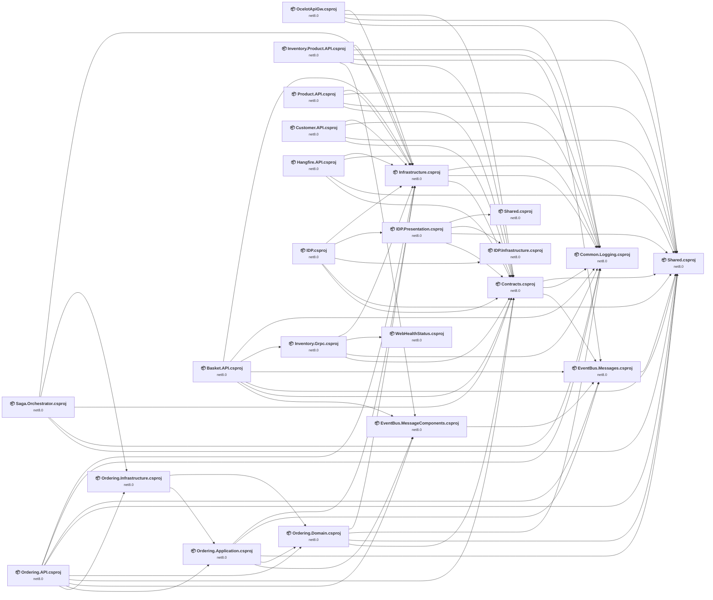

## Project Details

<a id="srcapigatewaysocelotapigwocelotapigwcsproj"></a>
### src\ApiGateways\OcelotApiGw\OcelotApiGw.csproj

#### Project Info

- **Current Target Framework:** net8.0
- **Proposed Target Framework:** net10.0
- **SDK-style**: True
- **Project Kind:** AspNetCore
- **Dependencies**: 4
- **Dependants**: 0
- **Number of Files**: 8
- **Number of Files with Incidents**: 3
- **Lines of Code**: 219
- **Estimated LOC to modify**: 15+ (at least 6.8% of the project)

#### Dependency Graph

Legend:
📦 SDK-style project
⚙️ Classic project

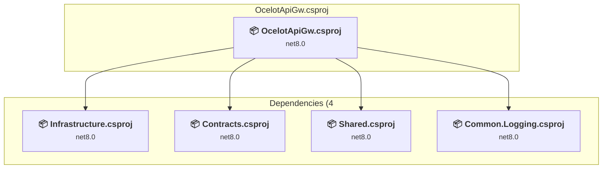

### API Compatibility

| Category | Count | Impact |
| :--- | :---: | :--- |
| 🔴 Binary Incompatible | 4 | High - Require code changes |
| 🟡 Source Incompatible | 11 | Medium - Needs re-compilation and potential conflicting API error fixing |
| 🔵 Behavioral change | 0 | Low - Behavioral changes that may require testing at runtime |
| ✅ Compatible | 292 |  |
| ***Total APIs Analyzed*** | ***307*** |  |

<a id="srcbuildingblockscommonloggingcommonloggingcsproj"></a>
### src\BuildingBlocks\Common.Logging\Common.Logging.csproj

#### Project Info

- **Current Target Framework:** net8.0
- **Proposed Target Framework:** net10.0
- **SDK-style**: True
- **Project Kind:** ClassLibrary
- **Dependencies**: 0
- **Dependants**: 12
- **Number of Files**: 2
- **Number of Files with Incidents**: 3
- **Lines of Code**: 92
- **Estimated LOC to modify**: 12+ (at least 13.0% of the project)

#### Dependency Graph

Legend:
📦 SDK-style project
⚙️ Classic project

```mermaid
flowchart TB
    subgraph upstream["Dependants (12)"]
        P3["<b>📦&nbsp;Contracts.csproj</b><br/><small>net8.0</small>"]
        P4["<b>📦&nbsp;Infrastructure.csproj</b><br/><small>net8.0</small>"]
        P5["<b>📦&nbsp;OcelotApiGw.csproj</b><br/><small>net8.0</small>"]
        P8["<b>📦&nbsp;Ordering.Domain.csproj</b><br/><small>net8.0</small>"]
        P12["<b>📦&nbsp;Inventory.Product.API.csproj</b><br/><small>net8.0</small>"]
        P13["<b>📦&nbsp;Inventory.Grpc.csproj</b><br/><small>net8.0</small>"]
        P14["<b>📦&nbsp;Saga.Orchestrator.csproj</b><br/><small>net8.0</small>"]
        P15["<b>📦&nbsp;Ordering.API.csproj</b><br/><small>net8.0</small>"]
        P16["<b>📦&nbsp;Basket.API.csproj</b><br/><small>net8.0</small>"]
        P17["<b>📦&nbsp;Product.API.csproj</b><br/><small>net8.0</small>"]
        P18["<b>📦&nbsp;Customer.API.csproj</b><br/><small>net8.0</small>"]
        P19["<b>📦&nbsp;Hangfire.API.csproj</b><br/><small>net8.0</small>"]
        click P3 "#srcbuildingblockscontractscontractscsproj"
        click P4 "#srcbuildingblocksinfrastructureinfrastructurecsproj"
        click P5 "#srcapigatewaysocelotapigwocelotapigwcsproj"
        click P8 "#srcservicesorderingorderingdomainorderingdomaincsproj"
        click P12 "#srcservicesinventoryinventoryproductapiinventoryproductapicsproj"
        click P13 "#srcservicesinventoryinventorygrpcinventorygrpccsproj"
        click P14 "#srcsagaorchestratorsagaorchestratorcsproj"
        click P15 "#srcservicesorderingorderingapiorderingapicsproj"
        click P16 "#srcservicesbasketbasketapibasketapicsproj"
        click P17 "#srcservicesproductproductapiproductapicsproj"
        click P18 "#srcservicescustomercustomerapicustomerapicsproj"
        click P19 "#srcservicesscheduledjobhangfireapihangfireapicsproj"
    end
    subgraph current["Common.Logging.csproj"]
        MAIN["<b>📦&nbsp;Common.Logging.csproj</b><br/><small>net8.0</small>"]
        click MAIN "#srcbuildingblockscommonloggingcommonloggingcsproj"
    end
    P3 --> MAIN
    P4 --> MAIN
    P5 --> MAIN
    P8 --> MAIN
    P12 --> MAIN
    P13 --> MAIN
    P14 --> MAIN
    P15 --> MAIN
    P16 --> MAIN
    P17 --> MAIN
    P18 --> MAIN
    P19 --> MAIN

```

### API Compatibility

| Category | Count | Impact |
| :--- | :---: | :--- |
| 🔴 Binary Incompatible | 3 | High - Require code changes |
| 🟡 Source Incompatible | 0 | Medium - Needs re-compilation and potential conflicting API error fixing |
| 🔵 Behavioral change | 9 | Low - Behavioral changes that may require testing at runtime |
| ✅ Compatible | 151 |  |
| ***Total APIs Analyzed*** | ***163*** |  |

<a id="srcbuildingblockscontractscontractscsproj"></a>
### src\BuildingBlocks\Contracts\Contracts.csproj

#### Project Info

- **Current Target Framework:** net8.0
- **Proposed Target Framework:** net10.0
- **SDK-style**: True
- **Project Kind:** ClassLibrary
- **Dependencies**: 3
- **Dependants**: 13
- **Number of Files**: 33
- **Number of Files with Incidents**: 2
- **Lines of Code**: 541
- **Estimated LOC to modify**: 1+ (at least 0.2% of the project)

#### Dependency Graph

Legend:
📦 SDK-style project
⚙️ Classic project

```mermaid
flowchart TB
    subgraph upstream["Dependants (13)"]
        P4["<b>📦&nbsp;Infrastructure.csproj</b><br/><small>net8.0</small>"]
        P5["<b>📦&nbsp;OcelotApiGw.csproj</b><br/><small>net8.0</small>"]
        P8["<b>📦&nbsp;Ordering.Domain.csproj</b><br/><small>net8.0</small>"]
        P12["<b>📦&nbsp;Inventory.Product.API.csproj</b><br/><small>net8.0</small>"]
        P13["<b>📦&nbsp;Inventory.Grpc.csproj</b><br/><small>net8.0</small>"]
        P14["<b>📦&nbsp;Saga.Orchestrator.csproj</b><br/><small>net8.0</small>"]
        P15["<b>📦&nbsp;Ordering.API.csproj</b><br/><small>net8.0</small>"]
        P16["<b>📦&nbsp;Basket.API.csproj</b><br/><small>net8.0</small>"]
        P17["<b>📦&nbsp;Product.API.csproj</b><br/><small>net8.0</small>"]
        P18["<b>📦&nbsp;Customer.API.csproj</b><br/><small>net8.0</small>"]
        P19["<b>📦&nbsp;Hangfire.API.csproj</b><br/><small>net8.0</small>"]
        P20["<b>📦&nbsp;IDP.csproj</b><br/><small>net8.0</small>"]
        P22["<b>📦&nbsp;IDP.Presentation.csproj</b><br/><small>net8.0</small>"]
        click P4 "#srcbuildingblocksinfrastructureinfrastructurecsproj"
        click P5 "#srcapigatewaysocelotapigwocelotapigwcsproj"
        click P8 "#srcservicesorderingorderingdomainorderingdomaincsproj"
        click P12 "#srcservicesinventoryinventoryproductapiinventoryproductapicsproj"
        click P13 "#srcservicesinventoryinventorygrpcinventorygrpccsproj"
        click P14 "#srcsagaorchestratorsagaorchestratorcsproj"
        click P15 "#srcservicesorderingorderingapiorderingapicsproj"
        click P16 "#srcservicesbasketbasketapibasketapicsproj"
        click P17 "#srcservicesproductproductapiproductapicsproj"
        click P18 "#srcservicescustomercustomerapicustomerapicsproj"
        click P19 "#srcservicesscheduledjobhangfireapihangfireapicsproj"
        click P20 "#srcservicesidentityidpidpcsproj"
        click P22 "#srcservicesidentitypresentationidppresentationcsproj"
    end
    subgraph current["Contracts.csproj"]
        MAIN["<b>📦&nbsp;Contracts.csproj</b><br/><small>net8.0</small>"]
        click MAIN "#srcbuildingblockscontractscontractscsproj"
    end
    subgraph downstream["Dependencies (3"]
        P6["<b>📦&nbsp;Shared.csproj</b><br/><small>net8.0</small>"]
        P1["<b>📦&nbsp;Common.Logging.csproj</b><br/><small>net8.0</small>"]
        P10["<b>📦&nbsp;EventBus.Messages.csproj</b><br/><small>net8.0</small>"]
        click P6 "#srcbuildingblockssharedsharedcsproj"
        click P1 "#srcbuildingblockscommonloggingcommonloggingcsproj"
        click P10 "#srcbuildingblockseventbuseventbusmessageseventbusmessagescsproj"
    end
    P4 --> MAIN
    P5 --> MAIN
    P8 --> MAIN
    P12 --> MAIN
    P13 --> MAIN
    P14 --> MAIN
    P15 --> MAIN
    P16 --> MAIN
    P17 --> MAIN
    P18 --> MAIN
    P19 --> MAIN
    P20 --> MAIN
    P22 --> MAIN
    MAIN --> P6
    MAIN --> P1
    MAIN --> P10

```

### API Compatibility

| Category | Count | Impact |
| :--- | :---: | :--- |
| 🔴 Binary Incompatible | 0 | High - Require code changes |
| 🟡 Source Incompatible | 0 | Medium - Needs re-compilation and potential conflicting API error fixing |
| 🔵 Behavioral change | 1 | Low - Behavioral changes that may require testing at runtime |
| ✅ Compatible | 720 |  |
| ***Total APIs Analyzed*** | ***721*** |  |

<a id="srcbuildingblockseventbuseventbusmessagecomponentseventbusmessagecomponentscsproj"></a>
### src\BuildingBlocks\EventBus\EventBus.MessageComponents\EventBus.MessageComponents.csproj

#### Project Info

- **Current Target Framework:** net8.0
- **Proposed Target Framework:** net10.0
- **SDK-style**: True
- **Project Kind:** ClassLibrary
- **Dependencies**: 1
- **Dependants**: 4
- **Number of Files**: 2
- **Number of Files with Incidents**: 1
- **Lines of Code**: 21
- **Estimated LOC to modify**: 0+ (at least 0.0% of the project)

#### Dependency Graph

Legend:
📦 SDK-style project
⚙️ Classic project

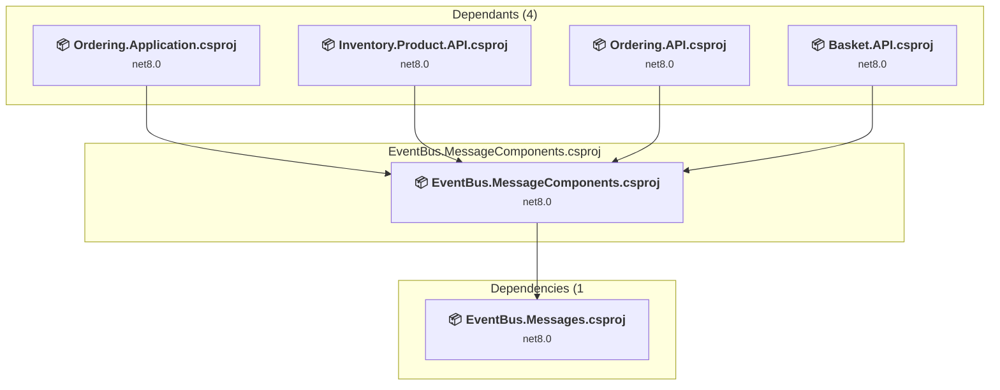

### API Compatibility

| Category | Count | Impact |
| :--- | :---: | :--- |
| 🔴 Binary Incompatible | 0 | High - Require code changes |
| 🟡 Source Incompatible | 0 | Medium - Needs re-compilation and potential conflicting API error fixing |
| 🔵 Behavioral change | 0 | Low - Behavioral changes that may require testing at runtime |
| ✅ Compatible | 38 |  |
| ***Total APIs Analyzed*** | ***38*** |  |

<a id="srcbuildingblockseventbuseventbusmessageseventbusmessagescsproj"></a>
### src\BuildingBlocks\EventBus\EventBus.Messages\EventBus.Messages.csproj

#### Project Info

- **Current Target Framework:** net8.0
- **Proposed Target Framework:** net10.0
- **SDK-style**: True
- **Project Kind:** ClassLibrary
- **Dependencies**: 1
- **Dependants**: 6
- **Number of Files**: 4
- **Number of Files with Incidents**: 1
- **Lines of Code**: 74
- **Estimated LOC to modify**: 0+ (at least 0.0% of the project)

#### Dependency Graph

Legend:
📦 SDK-style project
⚙️ Classic project

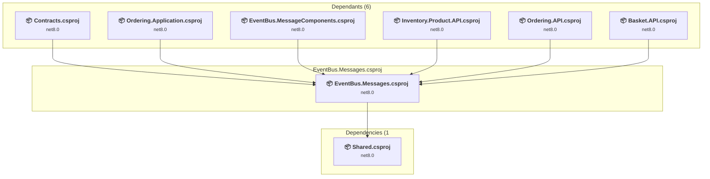

### API Compatibility

| Category | Count | Impact |
| :--- | :---: | :--- |
| 🔴 Binary Incompatible | 0 | High - Require code changes |
| 🟡 Source Incompatible | 0 | Medium - Needs re-compilation and potential conflicting API error fixing |
| 🔵 Behavioral change | 0 | Low - Behavioral changes that may require testing at runtime |
| ✅ Compatible | 156 |  |
| ***Total APIs Analyzed*** | ***156*** |  |

<a id="srcbuildingblocksinfrastructureinfrastructurecsproj"></a>
### src\BuildingBlocks\Infrastructure\Infrastructure.csproj

#### Project Info

- **Current Target Framework:** net8.0
- **Proposed Target Framework:** net10.0
- **SDK-style**: True
- **Project Kind:** ClassLibrary
- **Dependencies**: 3
- **Dependants**: 12
- **Number of Files**: 30
- **Number of Files with Incidents**: 7
- **Lines of Code**: 1599
- **Estimated LOC to modify**: 42+ (at least 2.6% of the project)

#### Dependency Graph

Legend:
📦 SDK-style project
⚙️ Classic project

```mermaid
flowchart TB
    subgraph upstream["Dependants (12)"]
        P5["<b>📦&nbsp;OcelotApiGw.csproj</b><br/><small>net8.0</small>"]
        P8["<b>📦&nbsp;Ordering.Domain.csproj</b><br/><small>net8.0</small>"]
        P9["<b>📦&nbsp;Ordering.Application.csproj</b><br/><small>net8.0</small>"]
        P12["<b>📦&nbsp;Inventory.Product.API.csproj</b><br/><small>net8.0</small>"]
        P13["<b>📦&nbsp;Inventory.Grpc.csproj</b><br/><small>net8.0</small>"]
        P14["<b>📦&nbsp;Saga.Orchestrator.csproj</b><br/><small>net8.0</small>"]
        P15["<b>📦&nbsp;Ordering.API.csproj</b><br/><small>net8.0</small>"]
        P16["<b>📦&nbsp;Basket.API.csproj</b><br/><small>net8.0</small>"]
        P17["<b>📦&nbsp;Product.API.csproj</b><br/><small>net8.0</small>"]
        P18["<b>📦&nbsp;Customer.API.csproj</b><br/><small>net8.0</small>"]
        P19["<b>📦&nbsp;Hangfire.API.csproj</b><br/><small>net8.0</small>"]
        P20["<b>📦&nbsp;IDP.csproj</b><br/><small>net8.0</small>"]
        click P5 "#srcapigatewaysocelotapigwocelotapigwcsproj"
        click P8 "#srcservicesorderingorderingdomainorderingdomaincsproj"
        click P9 "#srcservicesorderingorderingapplicationorderingapplicationcsproj"
        click P12 "#srcservicesinventoryinventoryproductapiinventoryproductapicsproj"
        click P13 "#srcservicesinventoryinventorygrpcinventorygrpccsproj"
        click P14 "#srcsagaorchestratorsagaorchestratorcsproj"
        click P15 "#srcservicesorderingorderingapiorderingapicsproj"
        click P16 "#srcservicesbasketbasketapibasketapicsproj"
        click P17 "#srcservicesproductproductapiproductapicsproj"
        click P18 "#srcservicescustomercustomerapicustomerapicsproj"
        click P19 "#srcservicesscheduledjobhangfireapihangfireapicsproj"
        click P20 "#srcservicesidentityidpidpcsproj"
    end
    subgraph current["Infrastructure.csproj"]
        MAIN["<b>📦&nbsp;Infrastructure.csproj</b><br/><small>net8.0</small>"]
        click MAIN "#srcbuildingblocksinfrastructureinfrastructurecsproj"
    end
    subgraph downstream["Dependencies (3"]
        P6["<b>📦&nbsp;Shared.csproj</b><br/><small>net8.0</small>"]
        P1["<b>📦&nbsp;Common.Logging.csproj</b><br/><small>net8.0</small>"]
        P3["<b>📦&nbsp;Contracts.csproj</b><br/><small>net8.0</small>"]
        click P6 "#srcbuildingblockssharedsharedcsproj"
        click P1 "#srcbuildingblockscommonloggingcommonloggingcsproj"
        click P3 "#srcbuildingblockscontractscontractscsproj"
    end
    P5 --> MAIN
    P8 --> MAIN
    P9 --> MAIN
    P12 --> MAIN
    P13 --> MAIN
    P14 --> MAIN
    P15 --> MAIN
    P16 --> MAIN
    P17 --> MAIN
    P18 --> MAIN
    P19 --> MAIN
    P20 --> MAIN
    MAIN --> P6
    MAIN --> P1
    MAIN --> P3

```

### API Compatibility

| Category | Count | Impact |
| :--- | :---: | :--- |
| 🔴 Binary Incompatible | 11 | High - Require code changes |
| 🟡 Source Incompatible | 24 | Medium - Needs re-compilation and potential conflicting API error fixing |
| 🔵 Behavioral change | 7 | Low - Behavioral changes that may require testing at runtime |
| ✅ Compatible | 1911 |  |
| ***Total APIs Analyzed*** | ***1953*** |  |

#### Project Technologies and Features

| Technology | Issues | Percentage | Migration Path |
| :--- | :---: | :---: | :--- |
| IdentityModel & Claims-based Security | 9 | 21.4% | Windows Identity Foundation (WIF), SAML, and claims-based authentication APIs that have been replaced by modern identity libraries. WIF was the original identity framework for .NET Framework. Migrate to Microsoft.IdentityModel.* packages (modern identity stack). |

<a id="srcbuildingblockssharedsharedcsproj"></a>
### src\BuildingBlocks\Shared\Shared.csproj

#### Project Info

- **Current Target Framework:** net8.0
- **Proposed Target Framework:** net10.0
- **SDK-style**: True
- **Project Kind:** ClassLibrary
- **Dependencies**: 0
- **Dependants**: 15
- **Number of Files**: 60
- **Number of Files with Incidents**: 1
- **Lines of Code**: 1250
- **Estimated LOC to modify**: 0+ (at least 0.0% of the project)

#### Dependency Graph

Legend:
📦 SDK-style project
⚙️ Classic project

```mermaid
flowchart TB
    subgraph upstream["Dependants (15)"]
        P3["<b>📦&nbsp;Contracts.csproj</b><br/><small>net8.0</small>"]
        P4["<b>📦&nbsp;Infrastructure.csproj</b><br/><small>net8.0</small>"]
        P5["<b>📦&nbsp;OcelotApiGw.csproj</b><br/><small>net8.0</small>"]
        P8["<b>📦&nbsp;Ordering.Domain.csproj</b><br/><small>net8.0</small>"]
        P9["<b>📦&nbsp;Ordering.Application.csproj</b><br/><small>net8.0</small>"]
        P10["<b>📦&nbsp;EventBus.Messages.csproj</b><br/><small>net8.0</small>"]
        P12["<b>📦&nbsp;Inventory.Product.API.csproj</b><br/><small>net8.0</small>"]
        P14["<b>📦&nbsp;Saga.Orchestrator.csproj</b><br/><small>net8.0</small>"]
        P15["<b>📦&nbsp;Ordering.API.csproj</b><br/><small>net8.0</small>"]
        P16["<b>📦&nbsp;Basket.API.csproj</b><br/><small>net8.0</small>"]
        P17["<b>📦&nbsp;Product.API.csproj</b><br/><small>net8.0</small>"]
        P18["<b>📦&nbsp;Customer.API.csproj</b><br/><small>net8.0</small>"]
        P19["<b>📦&nbsp;Hangfire.API.csproj</b><br/><small>net8.0</small>"]
        P20["<b>📦&nbsp;IDP.csproj</b><br/><small>net8.0</small>"]
        P22["<b>📦&nbsp;IDP.Presentation.csproj</b><br/><small>net8.0</small>"]
        click P3 "#srcbuildingblockscontractscontractscsproj"
        click P4 "#srcbuildingblocksinfrastructureinfrastructurecsproj"
        click P5 "#srcapigatewaysocelotapigwocelotapigwcsproj"
        click P8 "#srcservicesorderingorderingdomainorderingdomaincsproj"
        click P9 "#srcservicesorderingorderingapplicationorderingapplicationcsproj"
        click P10 "#srcbuildingblockseventbuseventbusmessageseventbusmessagescsproj"
        click P12 "#srcservicesinventoryinventoryproductapiinventoryproductapicsproj"
        click P14 "#srcsagaorchestratorsagaorchestratorcsproj"
        click P15 "#srcservicesorderingorderingapiorderingapicsproj"
        click P16 "#srcservicesbasketbasketapibasketapicsproj"
        click P17 "#srcservicesproductproductapiproductapicsproj"
        click P18 "#srcservicescustomercustomerapicustomerapicsproj"
        click P19 "#srcservicesscheduledjobhangfireapihangfireapicsproj"
        click P20 "#srcservicesidentityidpidpcsproj"
        click P22 "#srcservicesidentitypresentationidppresentationcsproj"
    end
    subgraph current["Shared.csproj"]
        MAIN["<b>📦&nbsp;Shared.csproj</b><br/><small>net8.0</small>"]
        click MAIN "#srcbuildingblockssharedsharedcsproj"
    end
    P3 --> MAIN
    P4 --> MAIN
    P5 --> MAIN
    P8 --> MAIN
    P9 --> MAIN
    P10 --> MAIN
    P12 --> MAIN
    P14 --> MAIN
    P15 --> MAIN
    P16 --> MAIN
    P17 --> MAIN
    P18 --> MAIN
    P19 --> MAIN
    P20 --> MAIN
    P22 --> MAIN

```

### API Compatibility

| Category | Count | Impact |
| :--- | :---: | :--- |
| 🔴 Binary Incompatible | 0 | High - Require code changes |
| 🟡 Source Incompatible | 0 | Medium - Needs re-compilation and potential conflicting API error fixing |
| 🔵 Behavioral change | 0 | Low - Behavioral changes that may require testing at runtime |
| ✅ Compatible | 2140 |  |
| ***Total APIs Analyzed*** | ***2140*** |  |

<a id="srcsagaorchestratorsagaorchestratorcsproj"></a>
### src\Saga.Orchestrator\Saga.Orchestrator.csproj

#### Project Info

- **Current Target Framework:** net8.0
- **Proposed Target Framework:** net10.0
- **SDK-style**: True
- **Project Kind:** AspNetCore
- **Dependencies**: 5
- **Dependants**: 0
- **Number of Files**: 19
- **Number of Files with Incidents**: 3
- **Lines of Code**: 635
- **Estimated LOC to modify**: 10+ (at least 1.6% of the project)

#### Dependency Graph

Legend:
📦 SDK-style project
⚙️ Classic project

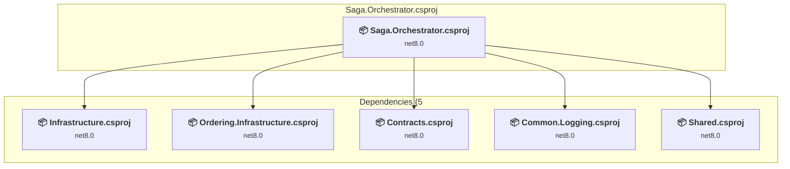

### API Compatibility

| Category | Count | Impact |
| :--- | :---: | :--- |
| 🔴 Binary Incompatible | 1 | High - Require code changes |
| 🟡 Source Incompatible | 0 | Medium - Needs re-compilation and potential conflicting API error fixing |
| 🔵 Behavioral change | 9 | Low - Behavioral changes that may require testing at runtime |
| ✅ Compatible | 559 |  |
| ***Total APIs Analyzed*** | ***569*** |  |

<a id="srcservicesbasketbasketapibasketapicsproj"></a>
### src\Services\Basket\Basket.API\Basket.API.csproj

#### Project Info

- **Current Target Framework:** net8.0
- **Proposed Target Framework:** net10.0
- **SDK-style**: True
- **Project Kind:** AspNetCore
- **Dependencies**: 7
- **Dependants**: 0
- **Number of Files**: 19
- **Number of Files with Incidents**: 3
- **Lines of Code**: 841
- **Estimated LOC to modify**: 18+ (at least 2.1% of the project)

#### Dependency Graph

Legend:
📦 SDK-style project
⚙️ Classic project

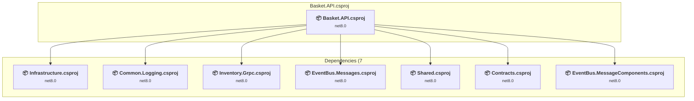

### API Compatibility

| Category | Count | Impact |
| :--- | :---: | :--- |
| 🔴 Binary Incompatible | 7 | High - Require code changes |
| 🟡 Source Incompatible | 4 | Medium - Needs re-compilation and potential conflicting API error fixing |
| 🔵 Behavioral change | 7 | Low - Behavioral changes that may require testing at runtime |
| ✅ Compatible | 1285 |  |
| ***Total APIs Analyzed*** | ***1303*** |  |

<a id="srcservicescustomercustomerapicustomerapicsproj"></a>
### src\Services\Customer\Customer.API\Customer.API.csproj

#### Project Info

- **Current Target Framework:** net8.0
- **Proposed Target Framework:** net10.0
- **SDK-style**: True
- **Project Kind:** AspNetCore
- **Dependencies**: 4
- **Dependants**: 0
- **Number of Files**: 19
- **Number of Files with Incidents**: 3
- **Lines of Code**: 1238
- **Estimated LOC to modify**: 16+ (at least 1.3% of the project)

#### Dependency Graph

Legend:
📦 SDK-style project
⚙️ Classic project

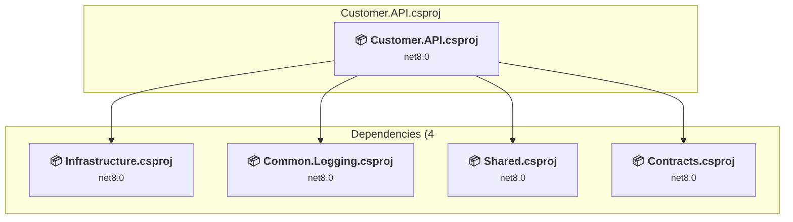

### API Compatibility

| Category | Count | Impact |
| :--- | :---: | :--- |
| 🔴 Binary Incompatible | 16 | High - Require code changes |
| 🟡 Source Incompatible | 0 | Medium - Needs re-compilation and potential conflicting API error fixing |
| 🔵 Behavioral change | 0 | Low - Behavioral changes that may require testing at runtime |
| ✅ Compatible | 1576 |  |
| ***Total APIs Analyzed*** | ***1592*** |  |

#### Project Technologies and Features

| Technology | Issues | Percentage | Migration Path |
| :--- | :---: | :---: | :--- |
| IdentityModel & Claims-based Security | 13 | 81.3% | Windows Identity Foundation (WIF), SAML, and claims-based authentication APIs that have been replaced by modern identity libraries. WIF was the original identity framework for .NET Framework. Migrate to Microsoft.IdentityModel.* packages (modern identity stack). |

<a id="srcservicesidentityidpidpcsproj"></a>
### src\Services\Identity\IDP\IDP.csproj

#### Project Info

- **Current Target Framework:** net8.0
- **Proposed Target Framework:** net10.0
- **SDK-style**: True
- **Project Kind:** AspNetCore
- **Dependencies**: 5
- **Dependants**: 0
- **Number of Files**: 53
- **Number of Files with Incidents**: 3
- **Lines of Code**: 5803
- **Estimated LOC to modify**: 21+ (at least 0.4% of the project)

#### Dependency Graph

Legend:
📦 SDK-style project
⚙️ Classic project

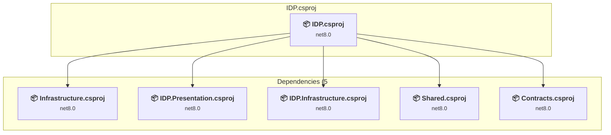

### API Compatibility

| Category | Count | Impact |
| :--- | :---: | :--- |
| 🔴 Binary Incompatible | 7 | High - Require code changes |
| 🟡 Source Incompatible | 6 | Medium - Needs re-compilation and potential conflicting API error fixing |
| 🔵 Behavioral change | 8 | Low - Behavioral changes that may require testing at runtime |
| ✅ Compatible | 9869 |  |
| ***Total APIs Analyzed*** | ***9890*** |  |

<a id="srcservicesidentityinfrastructureidpinfrastructurecsproj"></a>
### src\Services\Identity\Infrastructure\IDP.Infrastructure.csproj

#### Project Info

- **Current Target Framework:** net8.0
- **Proposed Target Framework:** net10.0
- **SDK-style**: True
- **Project Kind:** ClassLibrary
- **Dependencies**: 0
- **Dependants**: 2
- **Number of Files**: 35
- **Number of Files with Incidents**: 2
- **Lines of Code**: 2343
- **Estimated LOC to modify**: 2+ (at least 0.1% of the project)

#### Dependency Graph

Legend:
📦 SDK-style project
⚙️ Classic project

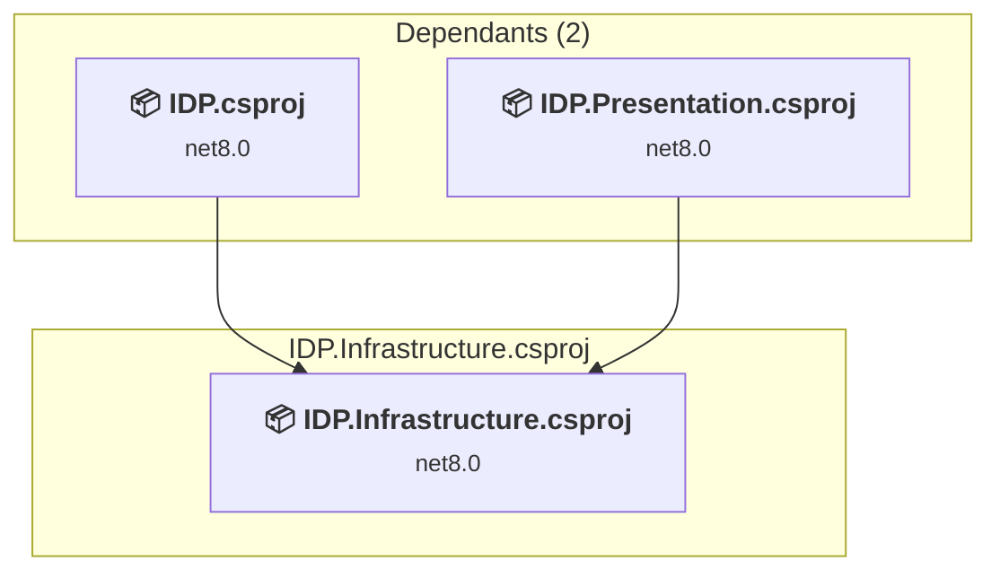

### API Compatibility

| Category | Count | Impact |
| :--- | :---: | :--- |
| 🔴 Binary Incompatible | 0 | High - Require code changes |
| 🟡 Source Incompatible | 2 | Medium - Needs re-compilation and potential conflicting API error fixing |
| 🔵 Behavioral change | 0 | Low - Behavioral changes that may require testing at runtime |
| ✅ Compatible | 2948 |  |
| ***Total APIs Analyzed*** | ***2950*** |  |

<a id="srcservicesidentitypresentationidppresentationcsproj"></a>
### src\Services\Identity\Presentation\IDP.Presentation.csproj

#### Project Info

- **Current Target Framework:** net8.0
- **Proposed Target Framework:** net10.0
- **SDK-style**: True
- **Project Kind:** ClassLibrary
- **Dependencies**: 4
- **Dependants**: 1
- **Number of Files**: 4
- **Number of Files with Incidents**: 1
- **Lines of Code**: 632
- **Estimated LOC to modify**: 0+ (at least 0.0% of the project)

#### Dependency Graph

Legend:
📦 SDK-style project
⚙️ Classic project

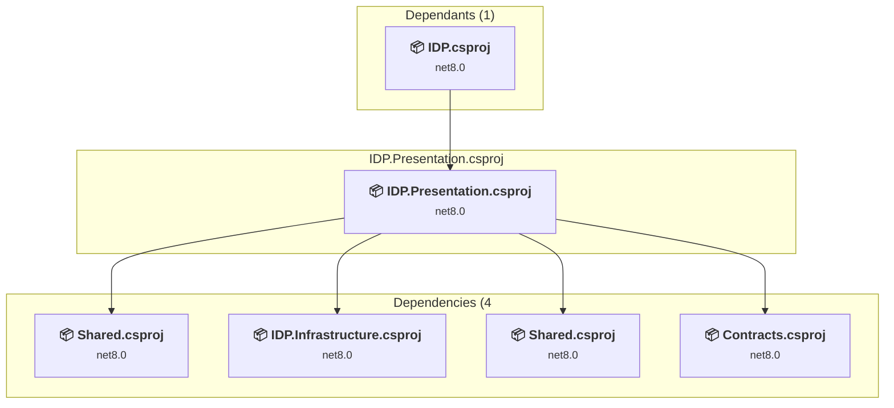

### API Compatibility

| Category | Count | Impact |
| :--- | :---: | :--- |
| 🔴 Binary Incompatible | 0 | High - Require code changes |
| 🟡 Source Incompatible | 0 | Medium - Needs re-compilation and potential conflicting API error fixing |
| 🔵 Behavioral change | 0 | Low - Behavioral changes that may require testing at runtime |
| ✅ Compatible | 936 |  |
| ***Total APIs Analyzed*** | ***936*** |  |

<a id="srcservicesidentitysharedsharedcsproj"></a>
### src\Services\Identity\Shared\Shared.csproj

#### Project Info

- **Current Target Framework:** net8.0
- **Proposed Target Framework:** net10.0
- **SDK-style**: True
- **Project Kind:** ClassLibrary
- **Dependencies**: 0
- **Dependants**: 1
- **Number of Files**: 2
- **Number of Files with Incidents**: 1
- **Lines of Code**: 26
- **Estimated LOC to modify**: 0+ (at least 0.0% of the project)

#### Dependency Graph

Legend:
📦 SDK-style project
⚙️ Classic project

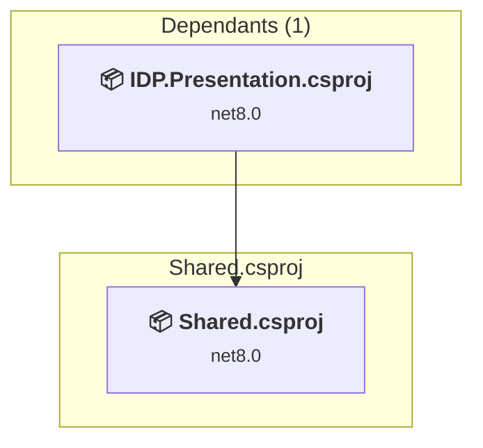

### API Compatibility

| Category | Count | Impact |
| :--- | :---: | :--- |
| 🔴 Binary Incompatible | 0 | High - Require code changes |
| 🟡 Source Incompatible | 0 | Medium - Needs re-compilation and potential conflicting API error fixing |
| 🔵 Behavioral change | 0 | Low - Behavioral changes that may require testing at runtime |
| ✅ Compatible | 0 |  |
| ***Total APIs Analyzed*** | ***0*** |  |

<a id="srcservicesinventoryinventorygrpcinventorygrpccsproj"></a>
### src\Services\Inventory\Inventory.Grpc\Inventory.Grpc.csproj

#### Project Info

- **Current Target Framework:** net8.0
- **Proposed Target Framework:** net10.0
- **SDK-style**: True
- **Project Kind:** AspNetCore
- **Dependencies**: 4
- **Dependants**: 1
- **Number of Files**: 7
- **Number of Files with Incidents**: 2
- **Lines of Code**: 168
- **Estimated LOC to modify**: 1+ (at least 0.6% of the project)

#### Dependency Graph

Legend:
📦 SDK-style project
⚙️ Classic project

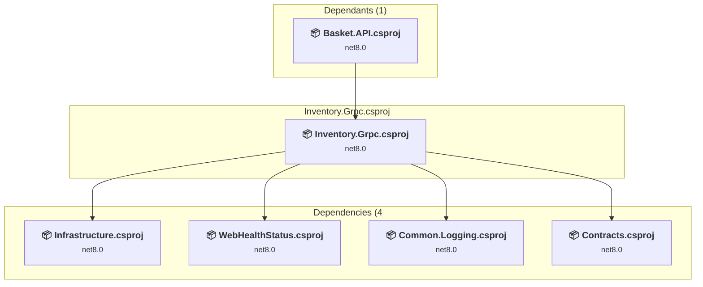

### API Compatibility

| Category | Count | Impact |
| :--- | :---: | :--- |
| 🔴 Binary Incompatible | 1 | High - Require code changes |
| 🟡 Source Incompatible | 0 | Medium - Needs re-compilation and potential conflicting API error fixing |
| 🔵 Behavioral change | 0 | Low - Behavioral changes that may require testing at runtime |
| ✅ Compatible | 563 |  |
| ***Total APIs Analyzed*** | ***564*** |  |

<a id="srcservicesinventoryinventoryproductapiinventoryproductapicsproj"></a>
### src\Services\Inventory\Inventory.Product.API\Inventory.Product.API.csproj

#### Project Info

- **Current Target Framework:** net8.0
- **Proposed Target Framework:** net10.0
- **SDK-style**: True
- **Project Kind:** AspNetCore
- **Dependencies**: 6
- **Dependants**: 0
- **Number of Files**: 12
- **Number of Files with Incidents**: 2
- **Lines of Code**: 604
- **Estimated LOC to modify**: 2+ (at least 0.3% of the project)

#### Dependency Graph

Legend:
📦 SDK-style project
⚙️ Classic project

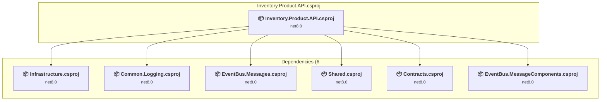

### API Compatibility

| Category | Count | Impact |
| :--- | :---: | :--- |
| 🔴 Binary Incompatible | 2 | High - Require code changes |
| 🟡 Source Incompatible | 0 | Medium - Needs re-compilation and potential conflicting API error fixing |
| 🔵 Behavioral change | 0 | Low - Behavioral changes that may require testing at runtime |
| ✅ Compatible | 736 |  |
| ***Total APIs Analyzed*** | ***738*** |  |

<a id="srcservicesorderingorderingapiorderingapicsproj"></a>
### src\Services\Ordering\Ordering.API\Ordering.API.csproj

#### Project Info

- **Current Target Framework:** net8.0
- **Proposed Target Framework:** net10.0
- **SDK-style**: True
- **Project Kind:** AspNetCore
- **Dependencies**: 9
- **Dependants**: 0
- **Number of Files**: 11
- **Number of Files with Incidents**: 2
- **Lines of Code**: 1025
- **Estimated LOC to modify**: 5+ (at least 0.5% of the project)

#### Dependency Graph

Legend:
📦 SDK-style project
⚙️ Classic project

```mermaid
flowchart TB
    subgraph current["Ordering.API.csproj"]
        MAIN["<b>📦&nbsp;Ordering.API.csproj</b><br/><small>net8.0</small>"]
        click MAIN "#srcservicesorderingorderingapiorderingapicsproj"
    end
    subgraph downstream["Dependencies (9"]
        P4["<b>📦&nbsp;Infrastructure.csproj</b><br/><small>net8.0</small>"]
        P1["<b>📦&nbsp;Common.Logging.csproj</b><br/><small>net8.0</small>"]
        P10["<b>📦&nbsp;EventBus.Messages.csproj</b><br/><small>net8.0</small>"]
        P6["<b>📦&nbsp;Shared.csproj</b><br/><small>net8.0</small>"]
        P8["<b>📦&nbsp;Ordering.Domain.csproj</b><br/><small>net8.0</small>"]
        P3["<b>📦&nbsp;Contracts.csproj</b><br/><small>net8.0</small>"]
        P11["<b>📦&nbsp;EventBus.MessageComponents.csproj</b><br/><small>net8.0</small>"]
        P9["<b>📦&nbsp;Ordering.Application.csproj</b><br/><small>net8.0</small>"]
        P7["<b>📦&nbsp;Ordering.Infrastructure.csproj</b><br/><small>net8.0</small>"]
        click P4 "#srcbuildingblocksinfrastructureinfrastructurecsproj"
        click P1 "#srcbuildingblockscommonloggingcommonloggingcsproj"
        click P10 "#srcbuildingblockseventbuseventbusmessageseventbusmessagescsproj"
        click P6 "#srcbuildingblockssharedsharedcsproj"
        click P8 "#srcservicesorderingorderingdomainorderingdomaincsproj"
        click P3 "#srcbuildingblockscontractscontractscsproj"
        click P11 "#srcbuildingblockseventbuseventbusmessagecomponentseventbusmessagecomponentscsproj"
        click P9 "#srcservicesorderingorderingapplicationorderingapplicationcsproj"
        click P7 "#srcservicesorderingorderinginfrastructureorderinginfrastructurecsproj"
    end
    MAIN --> P4
    MAIN --> P1
    MAIN --> P10
    MAIN --> P6
    MAIN --> P8
    MAIN --> P3
    MAIN --> P11
    MAIN --> P9
    MAIN --> P7

```

### API Compatibility

| Category | Count | Impact |
| :--- | :---: | :--- |
| 🔴 Binary Incompatible | 5 | High - Require code changes |
| 🟡 Source Incompatible | 0 | Medium - Needs re-compilation and potential conflicting API error fixing |
| 🔵 Behavioral change | 0 | Low - Behavioral changes that may require testing at runtime |
| ✅ Compatible | 1075 |  |
| ***Total APIs Analyzed*** | ***1080*** |  |

<a id="srcservicesorderingorderingapplicationorderingapplicationcsproj"></a>
### src\Services\Ordering\Ordering.Application\Ordering.Application.csproj

#### Project Info

- **Current Target Framework:** net8.0
- **Proposed Target Framework:** net10.0
- **SDK-style**: True
- **Project Kind:** ClassLibrary
- **Dependencies**: 5
- **Dependants**: 2
- **Number of Files**: 46
- **Number of Files with Incidents**: 2
- **Lines of Code**: 1051
- **Estimated LOC to modify**: 2+ (at least 0.2% of the project)

#### Dependency Graph

Legend:
📦 SDK-style project
⚙️ Classic project

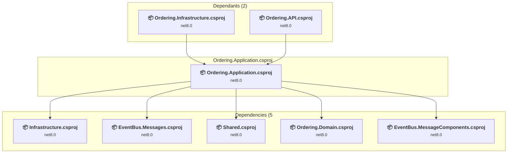

### API Compatibility

| Category | Count | Impact |
| :--- | :---: | :--- |
| 🔴 Binary Incompatible | 2 | High - Require code changes |
| 🟡 Source Incompatible | 0 | Medium - Needs re-compilation and potential conflicting API error fixing |
| 🔵 Behavioral change | 0 | Low - Behavioral changes that may require testing at runtime |
| ✅ Compatible | 1176 |  |
| ***Total APIs Analyzed*** | ***1178*** |  |

<a id="srcservicesorderingorderingdomainorderingdomaincsproj"></a>
### src\Services\Ordering\Ordering.Domain\Ordering.Domain.csproj

#### Project Info

- **Current Target Framework:** net8.0
- **Proposed Target Framework:** net10.0
- **SDK-style**: True
- **Project Kind:** ClassLibrary
- **Dependencies**: 4
- **Dependants**: 3
- **Number of Files**: 5
- **Number of Files with Incidents**: 1
- **Lines of Code**: 116
- **Estimated LOC to modify**: 0+ (at least 0.0% of the project)

#### Dependency Graph

Legend:
📦 SDK-style project
⚙️ Classic project

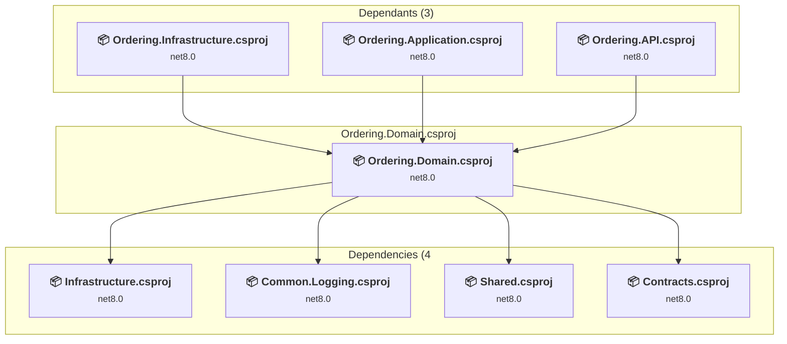

### API Compatibility

| Category | Count | Impact |
| :--- | :---: | :--- |
| 🔴 Binary Incompatible | 0 | High - Require code changes |
| 🟡 Source Incompatible | 0 | Medium - Needs re-compilation and potential conflicting API error fixing |
| 🔵 Behavioral change | 0 | Low - Behavioral changes that may require testing at runtime |
| ✅ Compatible | 180 |  |
| ***Total APIs Analyzed*** | ***180*** |  |

<a id="srcservicesorderingorderinginfrastructureorderinginfrastructurecsproj"></a>
### src\Services\Ordering\Ordering.Infrastructure\Ordering.Infrastructure.csproj

#### Project Info

- **Current Target Framework:** net8.0
- **Proposed Target Framework:** net10.0
- **SDK-style**: True
- **Project Kind:** ClassLibrary
- **Dependencies**: 2
- **Dependants**: 2
- **Number of Files**: 10
- **Number of Files with Incidents**: 2
- **Lines of Code**: 824
- **Estimated LOC to modify**: 4+ (at least 0.5% of the project)

#### Dependency Graph

Legend:
📦 SDK-style project
⚙️ Classic project

```mermaid
flowchart TB
    subgraph upstream["Dependants (2)"]
        P14["<b>📦&nbsp;Saga.Orchestrator.csproj</b><br/><small>net8.0</small>"]
        P15["<b>📦&nbsp;Ordering.API.csproj</b><br/><small>net8.0</small>"]
        click P14 "#srcsagaorchestratorsagaorchestratorcsproj"
        click P15 "#srcservicesorderingorderingapiorderingapicsproj"
    end
    subgraph current["Ordering.Infrastructure.csproj"]
        MAIN["<b>📦&nbsp;Ordering.Infrastructure.csproj</b><br/><small>net8.0</small>"]
        click MAIN "#srcservicesorderingorderinginfrastructureorderinginfrastructurecsproj"
    end
    subgraph downstream["Dependencies (2"]
        P8["<b>📦&nbsp;Ordering.Domain.csproj</b><br/><small>net8.0</small>"]
        P9["<b>📦&nbsp;Ordering.Application.csproj</b><br/><small>net8.0</small>"]
        click P8 "#srcservicesorderingorderingdomainorderingdomaincsproj"
        click P9 "#srcservicesorderingorderingapplicationorderingapplicationcsproj"
    end
    P14 --> MAIN
    P15 --> MAIN
    MAIN --> P8
    MAIN --> P9

```

### API Compatibility

| Category | Count | Impact |
| :--- | :---: | :--- |
| 🔴 Binary Incompatible | 2 | High - Require code changes |
| 🟡 Source Incompatible | 1 | Medium - Needs re-compilation and potential conflicting API error fixing |
| 🔵 Behavioral change | 1 | Low - Behavioral changes that may require testing at runtime |
| ✅ Compatible | 1111 |  |
| ***Total APIs Analyzed*** | ***1115*** |  |

<a id="srcservicesproductproductapiproductapicsproj"></a>
### src\Services\Product\Product.API\Product.API.csproj

#### Project Info

- **Current Target Framework:** net8.0
- **Proposed Target Framework:** net10.0
- **SDK-style**: True
- **Project Kind:** AspNetCore
- **Dependencies**: 4
- **Dependants**: 0
- **Number of Files**: 61
- **Number of Files with Incidents**: 4
- **Lines of Code**: 9420
- **Estimated LOC to modify**: 12+ (at least 0.1% of the project)

#### Dependency Graph

Legend:
📦 SDK-style project
⚙️ Classic project

```mermaid
flowchart TB
    subgraph current["Product.API.csproj"]
        MAIN["<b>📦&nbsp;Product.API.csproj</b><br/><small>net8.0</small>"]
        click MAIN "#srcservicesproductproductapiproductapicsproj"
    end
    subgraph downstream["Dependencies (4"]
        P4["<b>📦&nbsp;Infrastructure.csproj</b><br/><small>net8.0</small>"]
        P1["<b>📦&nbsp;Common.Logging.csproj</b><br/><small>net8.0</small>"]
        P6["<b>📦&nbsp;Shared.csproj</b><br/><small>net8.0</small>"]
        P3["<b>📦&nbsp;Contracts.csproj</b><br/><small>net8.0</small>"]
        click P4 "#srcbuildingblocksinfrastructureinfrastructurecsproj"
        click P1 "#srcbuildingblockscommonloggingcommonloggingcsproj"
        click P6 "#srcbuildingblockssharedsharedcsproj"
        click P3 "#srcbuildingblockscontractscontractscsproj"
    end
    MAIN --> P4
    MAIN --> P1
    MAIN --> P6
    MAIN --> P3

```

### API Compatibility

| Category | Count | Impact |
| :--- | :---: | :--- |
| 🔴 Binary Incompatible | 2 | High - Require code changes |
| 🟡 Source Incompatible | 2 | Medium - Needs re-compilation and potential conflicting API error fixing |
| 🔵 Behavioral change | 8 | Low - Behavioral changes that may require testing at runtime |
| ✅ Compatible | 12361 |  |
| ***Total APIs Analyzed*** | ***12373*** |  |

<a id="srcservicesscheduledjobhangfireapihangfireapicsproj"></a>
### src\Services\ScheduledJob\Hangfire.API\Hangfire.API.csproj

#### Project Info

- **Current Target Framework:** net8.0
- **Proposed Target Framework:** net10.0
- **SDK-style**: True
- **Project Kind:** AspNetCore
- **Dependencies**: 4
- **Dependants**: 0
- **Number of Files**: 13
- **Number of Files with Incidents**: 3
- **Lines of Code**: 985
- **Estimated LOC to modify**: 4+ (at least 0.4% of the project)

#### Dependency Graph

Legend:
📦 SDK-style project
⚙️ Classic project

```mermaid
flowchart TB
    subgraph current["Hangfire.API.csproj"]
        MAIN["<b>📦&nbsp;Hangfire.API.csproj</b><br/><small>net8.0</small>"]
        click MAIN "#srcservicesscheduledjobhangfireapihangfireapicsproj"
    end
    subgraph downstream["Dependencies (4"]
        P4["<b>📦&nbsp;Infrastructure.csproj</b><br/><small>net8.0</small>"]
        P1["<b>📦&nbsp;Common.Logging.csproj</b><br/><small>net8.0</small>"]
        P6["<b>📦&nbsp;Shared.csproj</b><br/><small>net8.0</small>"]
        P3["<b>📦&nbsp;Contracts.csproj</b><br/><small>net8.0</small>"]
        click P4 "#srcbuildingblocksinfrastructureinfrastructurecsproj"
        click P1 "#srcbuildingblockscommonloggingcommonloggingcsproj"
        click P6 "#srcbuildingblockssharedsharedcsproj"
        click P3 "#srcbuildingblockscontractscontractscsproj"
    end
    MAIN --> P4
    MAIN --> P1
    MAIN --> P6
    MAIN --> P3

```

### API Compatibility

| Category | Count | Impact |
| :--- | :---: | :--- |
| 🔴 Binary Incompatible | 2 | High - Require code changes |
| 🟡 Source Incompatible | 2 | Medium - Needs re-compilation and potential conflicting API error fixing |
| 🔵 Behavioral change | 0 | Low - Behavioral changes that may require testing at runtime |
| ✅ Compatible | 921 |  |
| ***Total APIs Analyzed*** | ***925*** |  |

<a id="srcwebappswebhealthstatuswebhealthstatuscsproj"></a>
### src\WebApps\WebHealthStatus\WebHealthStatus.csproj

#### Project Info

- **Current Target Framework:** net8.0
- **Proposed Target Framework:** net10.0
- **SDK-style**: True
- **Project Kind:** AspNetCore
- **Dependencies**: 0
- **Dependants**: 1
- **Number of Files**: 4
- **Number of Files with Incidents**: 2
- **Lines of Code**: 74
- **Estimated LOC to modify**: 2+ (at least 2.7% of the project)

#### Dependency Graph

Legend:
📦 SDK-style project
⚙️ Classic project

```mermaid
flowchart TB
    subgraph upstream["Dependants (1)"]
        P13["<b>📦&nbsp;Inventory.Grpc.csproj</b><br/><small>net8.0</small>"]
        click P13 "#srcservicesinventoryinventorygrpcinventorygrpccsproj"
    end
    subgraph current["WebHealthStatus.csproj"]
        MAIN["<b>📦&nbsp;WebHealthStatus.csproj</b><br/><small>net8.0</small>"]
        click MAIN "#srcwebappswebhealthstatuswebhealthstatuscsproj"
    end
    P13 --> MAIN

```

### API Compatibility

| Category | Count | Impact |
| :--- | :---: | :--- |
| 🔴 Binary Incompatible | 1 | High - Require code changes |
| 🟡 Source Incompatible | 0 | Medium - Needs re-compilation and potential conflicting API error fixing |
| 🔵 Behavioral change | 1 | Low - Behavioral changes that may require testing at runtime |
| ✅ Compatible | 96 |  |
| ***Total APIs Analyzed*** | ***98*** |  |

