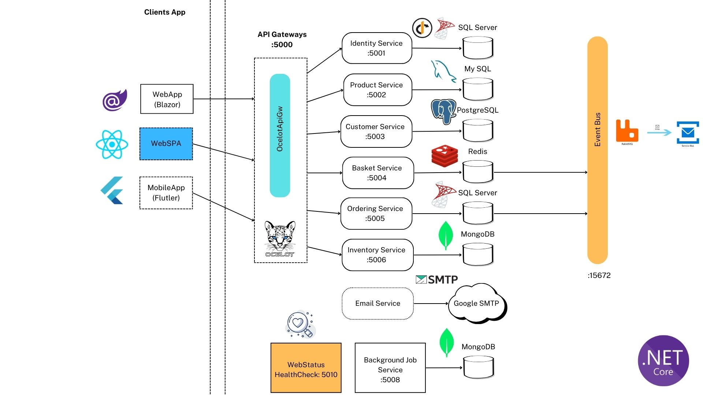


---

# 🛒 AspNetCore Microservices - Basic E-Commerce System


## 📌 Overview

This is a **modular e-commerce platform** built using **microservices architecture** with **ASP.NET Core**, **Docker**, and **Clean Architecture** principles. Each microservice is independently deployable, scalable, and communicates via **REST**, **gRPC**, and **event-driven messaging**.

### 🧭 Key Capabilities

* Identity management with **JWT + IdentityServer**
* Product browsing, cart, checkout, and order management
* Orchestration via **Saga Pattern**
* Event-driven communication using **RabbitMQ**
* Background jobs, monitoring, logging, and health checks

---

## 🧱 Microservices Architecture

| Service               | Port (Dev) | Port (Docker) | Protocol | Database   |
| --------------------- | ---------- | ------------- | -------- | ---------- |
| Identity Service      | 5001       | 6001          | REST     | SQL Server |
| Product Service       | 5002       | 6002          | REST     | MySQL      |
| Customer Service      | 5003       | 6003          | REST     | PostgreSQL |
| Basket Service        | 5004       | 6004          | REST     | Redis      |
| Ordering Service      | 5005       | 6005          | REST     | SQL Server |
| Inventory Service     | 5007       | 6007          | gRPC     | MongoDB    |
| Background Job        | 5008       | 6008          | Worker   | MongoDB    |
| **Saga Orchestrator** | **5009**   | **6009**      | REST     | -          |
| Health Check UI       | 5010       | 6010          | UI       | -          |
| API Gateway (Ocelot)  | 5000       | 6000          | Gateway  | -          |

---

## 🧠 Software Design Strategies

### 🔨 Architecture Styles

* **Microservice Architecture**
* **Clean Architecture** per service
* **Domain-Driven Design (DDD)**
* **Event-driven Architecture**
* **CQRS (Command Query Responsibility Segregation)**
* **Saga Pattern** (via Orchestrator)

### 🧰 Design Patterns

* **Repository & Unit of Work**
* **Mediator Pattern** (MediatR)
* **API Gateway Pattern** (Ocelot)
* **Outbox Pattern**
* **Adapter Pattern** (gRPC cross-service calls)
* **Worker Service** for async jobs

### 🎬 Saga Orchestration

The **Saga.Orchestrator** service coordinates long-running distributed transactions (e.g., inventory check, payment, order validation). It listens to events and issues compensating commands when needed — enhancing resilience across services.

---

## 🛠 Development Environment

### Required Software

* [.NET 8 SDK](https://dotnet.microsoft.com)
* Visual Studio 2022+, Rider, or VS Code
* Docker Desktop
* Node.js (for SPA frontend if applicable)


---

## 🚀 Running the System

### 🔧 Build the Solution

```bash
dotnet build
```

### 🐳 Docker Compose

```bash
docker-compose -f docker-compose.yml -f docker-compose.override.yml up -d --remove-orphans --build
```

To stop:

```bash
docker-compose down
```

### 🧪 Visual Studio

* Open `aspnetcore-microservices.sln`
* Set **Compound Launch Profile**
* Press F5 to run all services

---

## 🌐 Application URLs

### LOCAL (Docker)

* **Product API**: [http://localhost:6002](http://localhost:6002)
* **Customer API**: [http://localhost:6003](http://localhost:6003)
* **Basket API**: [http://localhost:6004](http://localhost:6004)
* **Ordering API**: [http://localhost:6005](http://localhost:6005)
* **Inventory (gRPC)**: `6007`
* **Background Job**: `6008`
* **Saga Orchestrator**: [http://localhost:6009](http://localhost:6009)
* **Health Check UI**: [http://localhost:6010](http://localhost:6010)
* **API Gateway**: [http://localhost:6000](http://localhost:6000)

### DEVELOPMENT (non-docker)

* Same ports as above but in 500X range

### Infrastructure

* **RabbitMQ**: [http://localhost:15672](http://localhost:15672) (`guest/guest`)
* **PgAdmin**: [http://localhost:5050](http://localhost:5050)
* **Kibana**: [http://localhost:5601](http://localhost:5601)
* **Portainer**: [http://localhost:9000](http://localhost:9000)

---

## 🧪 Useful Commands

### EF Core Migrations (Ordering)

```bash
cd src/Services/Ordering

dotnet ef migrations add Init \
 -p Ordering.Infrastructure \
 --startup-project Ordering.API \
 --output-dir Persistence/Migrations

dotnet ef database update \
 -p Ordering.Infrastructure \
 --startup-project Ordering.API
```

### Others

```bash
dotnet restore
dotnet build
dotnet watch run --project Product.API
```

---

## 🗂 Databases Used

* **ProductDB**: MySQL
* **CustomerDB**: PostgreSQL
* **OrderDB**: SQL Server
* **BasketDB**: Redis
* **InventoryDB & Job**: MongoDB
* **IdentityDB**: SQL Server (via IdentityServer)

---

## 📖 References

* [eShopOnContainers](https://github.com/dotnet-architecture/eShopOnContainers)
* [Saga Pattern in Microservices](https://microservices.io/patterns/data/saga.html)
* [Clean Architecture](https://github.com/ardalis/CleanArchitecture)
* [.NET Microservices Guide](https://docs.microsoft.com/dotnet/architecture/microservices/)

---

## ✅ Contributors

Maintained by **Marethy**
Feel free to open an issue or PR — contributions are welcome! 💙

---

